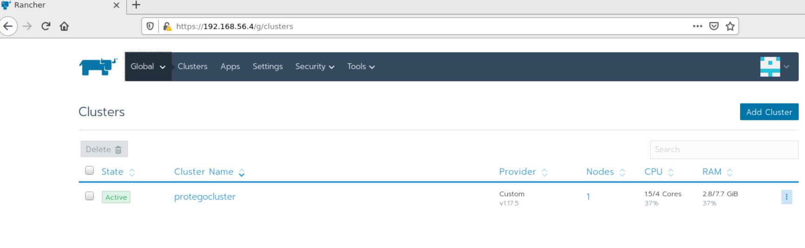

# ProTego Integration Toolkit Box by ICE

## Overview

The ProTego Box is a virtual machine with all the components from the 
ProTego Integration Toolkit ready to be used by the ProTego partners in order to do integration 
tests of the components with the platform at their home environment.

The virtual machine is a Vagrant Box based on Ubuntu 16 with all the required software to 
deploy the components.

The box comprises the following software: Java, Docker, Rancher, Kubernetes (RKE), Istio.

A Kubernetes cluster has been created and Rancher has been installed, 
discovering the cluster, and also installing Istio and some of its components. 
In order to be used with a minimum of resources if needed, 
Istio has been installed with minimal profile but including some additional components like kiali or prometheus.

In addition, some scripts have been deployed in the box for ease of app configuration and deployment in the platform.

This document is intended to be a step by step document for using the ProTego Box. 
As a brief overview these are the steps described:
* Installing Vagrant
* Downloading the Vagrantfile
* Running the ProTego Box
* Navigating through the Protego Box

## Installing Vagrant
Basically download the latest release of vagrant from https://www.vagrantup.com/ 
and follow the installation instructions from the Getting Started guide.

In addition, since a Vagrant Box is based on a virtual machine provider, 
you have to also install the virtual machine software. 

ICE is providing the VirtualBox version so far. We're working on possibly providing also 
a Hyperv box version, but no timeline for this release.

Please follow the instructions at VirtualBox documentation https://www.virtualbox.org/ 
in order to install the latest release of Virtual Box.

## Downloading the Vagrantfile and the ProtegoBox
The Vagrantfile has been uploaded to ProTego's sharepoint WorkPackages/WP6/ProtegoBox/Vagrantfile_vb 
`https://gfi1.sharepoint.com/:u:/r/sites/ES-PROTEGO-ALL/Documents%20partages/Work%20Packages/WP6/ProtegoBox/Vagrantfile_vb?csf=1&web=1&e=MjfrMO`.

The Vagrantfile for VirtualBox Vagrantfile_vb has been provided. Download and rename it to Vagrantfile.

The Protego Box version for VirtualBox has been uploaded to ProTego’s Sharepoint WorkPackages/WP6/ProtegoBox/rancherprotego_vb.box 
`https://gfi1.sharepoint.com/:u:/r/sites/ES-PROTEGO-ALL/Documents%20partages/Work%20Packages/WP6/ProtegoBox/rancherprotego_vb.box?csf=1&web=1&e=IHl9Vq`.

Download the box from the repository and place it in the same directory of the Vagrantfile.

## Running the Protego Box
 
Once vagrant has been installed and you have the Vagrantfile and the ProTego box in the run `vagrant up` from the command line, and this will boot the Protego Box.

Use the Vagrantfile and Protego box for the same provider (VirtualBox).

In order to stop the Box, you have to run `vagrant destroy` from your Host Machine.
This will stop/destroy the box without saving any changes made.

If you need to save any file from your Guest Machine, you can copy it to the shared directory `/vagrant` in your Guest Machine,  
which corresponds to the directory where the Vagrantfile is in your Host Machine.

You will need around 20 GB of free space in the disk where VirtualBox has been installed (typically C: if using Windows).

* #### Known Issues

  If running the box on a previous Hyperv environment, you may need to set the provider by either one of these options:
  
  + Run vagrant up with provider option.
    ```
    vagrant up --provider=virtualbox
    ```
  
  + Change the windows environment variable VAGRANT_DEFAULT_PROVIDER to virtualbox.
  
  Also having the vagrant plugin vagrant-vbguest (`vagrant plugin list`) for the Guest additions may cause some issues when starting the box:
  
  ```
  C:/HashiCorp/Vagrant/embedded/gems/2.2.9/gems/net-ssh-5.2.0/lib/net/ssh/buffered_io.rb:66:in `recv': An existing connection was forcibly closed by the remote host. - recvfrom(2) (Errno::ECONNRESET)
  ```
  
  In that case, you can workaround this by one of these options:
  
  + Uninstall the vagrant-vbguest plugin: `vagrant plugin uninstall vagrant-vbguest`
  
  + Add configuration to the Vagrantfile:
  
  ```
  config.winrm.retry_limit = 30
  config.winrm.retry_delay = 10
  ```
  
## Navigating through the Protego Box

* ### SSH Connection
  Once the box is up and running is time to login the box.
   
  In order to connect to the remote box you will use an ssh connection. 
  
  You can run `vagrant ssh` from the command line and this will log you in the machine with no password.
  
  If you want to use any other ssh terminals, because you may want to do some kind 
  of X-redirection or any advanced feature, by default the box redirects the guest machine 
  (that is the box machine) ssh port (22) to port 2222 at 127.0.0.1 (localhost) 
  of the host machine (that is your machine). 
  
  So you can connect by running and ssh connection to 127.0.0.1, port 2222. 
  In that case you will be logging in with username/password vagrant/vagrant.

  i.e.: salant@sgx-lnx:~$ ssh vagrant@127.0.0.1 -p 2222

* ### Accessing the Rancher UI
  You can access the Rancher UI from the host machine by accessing http://192.168.56.4 
  from your browser. Then login as admin/rancheradmin.

  From here you can access to all kubernetes resources created, such as the app deployment, 
  service and monitor their status. 

  In addition we’ve granted you administrator access, 
  so you can access to system namespace, but we recommend not to change anything.

  For some of the apps dashboard, you may need local access, 
  that is accessing from the Guest Machine.

  In that case, firefox is installed in the box, 
  so you can log in the box using X-redirection, and then run 
  firefox. 

  Now you can access internal url's using localhost or other ip's you can't access from outside 
  the box.
  
  
  
  + #### Accessing the kiali dashboard
  
  Istio has been installed as the service mesh for the ProTego box, 
  and there are some additional add-ons that have been installed as well.
  
  One of them is kiali, which is a UI to manage some istio resources and also provides a graph view of the mesh.
  In order to view this dashboard, you have to publish it temporarily. 
  Run `istioctl dashboard kiali` from the shell and this will allow you to access the dashboard from 
  the local firefox at http://127.0.0.1:20001/kiali with username/password kiali/kiali.
  
Similarly:  istioctl dashboard prometheus
  ```
  istioctl dashboard kiali
  http://localhost:20001/kiali
  Failed to open browser; open http://localhost:20001/kiali in your browser.
  ```
  
  The Failed message means it can't open a browser from the shell but it is ok, the dashboard has been published.
  Run firefox from another shell window and access the url.
  
* ### Scrips & Directories

  We're providing some basic scripts to be able to deploy your app.
  The scripts are located in the ProTego Gitlab repository at the Integration Toolkit Project, 
  ProTego Integration Toolkit Box repository, protegoscripts dir. Download them or clone the repository. 
  Then place them at ProTego Box /home/vagrant, once is up and running. 
  
  To do so, you can place them in the directory where the box has been downloaded. 
  Then, ssh connect to the box, and you can access the shared dir at /vagrant, where you'll be able 
  to copy the dir, `cp -r /vagrant/protegoscript/`.  
  
  If you are using an ssh client with sftp capabilities, you can also use it, drag & drop the folder 
  to the /home/vagrant directory.
  
  In this protegoscript dir is also included the subdirectory protegochart, 
  which is the basic helm chart template that you have to modify in order to deploy your app.
  
  Also, once logged in as vagrant user, at vagrant's home directory (/home/vagrant/) 
  there is a subdirectory protegobook.

  The protegobook is the helm chart for the protegobook app deployed to the platform.
  This is a sample app that will be used by some of the protego use-cases such as OpenVas scanning.

* ### Deploying apps

  As said, we've provided some scripts and templates to help in the deployment process.  
  Those scripts are found together with the Vagrantfile file.
  
  In order to use them, you have to assign execution permission to them.
  ```
  cd protegoscripts
  chmod +x *.sh
  ```

  In addition, we've deployed a docker registry and a helm chart catalog to store your docker images 
  and helm charts. The deployment will be done using those repositories.

  #### Push the docker image to the docker registry
  First of all you need to push your docker images to the docker registry which has been installed 
  at 192.168.56.4:31965

  You can push your image from you IDE, or you can build your image in the box, tag the image
  and then push it to the registry:
  
  tag: `docker image tag originalname:version 192.168.56.4:31965/name:version`
  
  push: `docker push 192.168.56.4:31965/name:version`
  
  #### Create a helm chartls 
  
  Once your image is pushed, you have to create a new helm chart from the template using the script provided `chart_crete.sh`
  
  ```
  ./chart_create.sh protegochart/ newprotegochart
  Creating newprotegochart
  ```
  
  This creates the helm chart directory structure and copies the necessary files from the template chart protegochart.
  
  This step has to be repeated and create a new helm chart if you want to redeploy the chart and 
  do not want to change the version and upgrade the current deployed app. That is, if you delete the 
  deployed app and delete the chart from the catalog, and want to deploy the same chart version with 
  some changed values, you have to create a new helm chart or change the version in the Chart.yaml 
  to a different version than the one previously deployed. 
  This is a known issue from rancher/chartmuseum.  
  
  #### Edit the helm chart
  
  Once your image is pushed, you need to update some values in the helm chart template.
  
  Edit the fields in the file newprotegochart/values.yaml:
  
  image.name: the docker image name including the tag.
  
  app.name: the app name
  
  app.port: the port where the app is listening, by default, this will be the port exposed from the app service.
  
  ```
  image:
    repository: 192.168.56.4:31965
    name: protegohello:1.0
    #pullPolicy: IfNotPresent
    # Overrides the image tag whose default is the chart version.
    #tag: ""
  
  app:
    name: hello
    port: 80
  ```
  
  You can also change the type of the service if you want to access it from outside the box, 
  by setting the service.type to NodePort, or the better way, answering the questions 
  when deploying the app.
  
  You can configure also persistence for the deployment in the vm filesystem. To enable this, 
  edit the values.yaml file:
  
  enabled: to enable the persistence. Set to false default.
  
  storage: the required capacity.
  
  path: the box filesystem local directory (you have to create it in case it does not exist).
  
  accessmode: the kubernetes access mode for persistent volumes and persistent volume claims. This default value should be ok for most of the cases.
  
  mountpath: the local path of the component.
  
  ```
  persistence:
    enabled: false
    storage: 1Gi
    path: "/mnt/data"
    accessmode: ReadWriteOnce
    mountpath: "/usr/share/nginx/html"
  ```
  
  #### Deploy the helm chart
  
  To do so, you'll use the scripts provided:
  
  First, once the helm chart template has been modified with the corresponding app values, you have 
  to package the helm chart.
  
  `./chart_package.sh chartpath` where chartpath is the path to the helm chart.
  
  ```
  ./chart_package.sh newprotegochart/
  Successfully packaged chart and saved it to: /home/vagrant/newprotegochart-0.1.0.tgz
  ```
  
  Then you have to upload the helm package to the helm catalog. 
  Use the packaged chart name from previous step, i.e. newprotegochart-0.1.0.tgz.
  
  `./chart_upload.sh protegochart-0.1.0.tgz`
  
  ```
  ./chart_upload.sh newprotegochart-0.1.0.tgz
  {"saved":true}vagrant@masternode:~$
  ```
  
  Once the chart is in the catalog, you have to refresh the catalog at rancher, so it can be deployed.
  
  `./catalog_refresh.sh`
  
  ```
  ./catalog_refresh.sh
  Rancher Protego Helm Catalog refreshed
  ```
  
  Now, the chart (app) can be deployed.
  
  `./app_deploy.sh newprotegochart protegoapp` where the chartname is the one stored in the catalog, 
  and the appname is the name of the app to be given when deploying it, i.e. protegoapp. 
  This appname does not have to be the same name from the helm chart values.yaml file, 
  it can be any name you want to set this deployment.
  
  ```
  ./app_deploy.sh newprotegochart protegoapp
  run "app show-notes protegoapp" to view app notes once app is ready
  ```
  
  You do not need to run the show-notes command after deploying the app.
  
  #### Access the app
  
  Once the app has been deployed, you can access it using the firefox local access mode describe previously 
  by getting the service cluster ip and the port configured in the helm chart, accessing the url http://{serviceClusterIP.ip}:{serviceClusterIP.port}
  
  In order to get the service ip and port you can run the provided script app_url.sh and then get the CLUSTER-IP and PORT(S) fields.
  
  ```
  ./app_url.sh productpage
  NAME          TYPE        CLUSTER-IP     EXTERNAL-IP   PORT(S)    AGE
  productpage   ClusterIP   10.43.70.194   <none>        9080/TCP   2d23h
  ```
  
  So in this example the app url would be http://10.43.70.194:9080.

 To enter a pod:
 kubectl get pods
 kubectl exec --stdin --tty els-fhir-7cf486f96c-zb25w  -- /bin/bash

  
  #### Deploying a new version
  
  The helm catalog can contain only one chart with the same name and version. If you do some changes to 
  the chart/app and want do re-deploy the app, you have to change the version of the Chart editing 
  protegochart/Chart.yaml and changing the value to a new version. 
  
  Follow the previous steps in order to package the chart and upload it to the catalog, 
  then refresh the catalog and run the script app_upgrade.sh instead of app_deploy.sh
  
  `./app_upgrade.sh protegoapp 0.2.0`

Apps can be listed with: rancher apps ls
  (DO THIS WHILE ORIGINAL APP IS STILL RUNNING!)
  
  #### Deleting the app
  
  If you need to delete (undeploy) the app, you can run the script `app_delete.sh`. 
  This will delete all the deployments and services belonging to the app in rancher/kubernetes.
  
  ```
  ./app_delete.sh protegobook
  ```
  
  #### Additional scripts
  
  Some additional scripts have been provided in order to manage the docker registry and helm catalog.
  
  list_images.sh : script to list the images stored in the docker registry.
  
  ```
  ./list_images.sh
  {"repositories":["examples-bookinfo-details-v1","examples-bookinfo-mysqldb","examples-bookinfo-productpage-v1","examples-bookinfo-ratings-v2","examples-bookinfo-reviews-v2","protegohello"]}
  ```  
  list_catalog.sh: script to list the helm charts stored in the helm catalog.
  
  ```
  ./list_catalog.sh
  apiVersion: v1
  entries:
    protegobook:
    - apiVersion: v2
      appVersion: 1.16.0
      created: "2020-05-29T10:00:06.239162772Z"
      description: A Helm chart for Kubernetes
      digest: f47a156a4c9a8572df2be433e23a13c06634014e54552ad9936ecb0a6c995fff
      name: protegobook
      urls:
      - charts/protegobook-0.1.0.tgz
      version: 0.1.0
  generated: "2020-05-29T10:00:12Z"
  serverInfo: {}
  ```
  
  For additional commands for docker registry and helm catalog, please see documentation 
  https://docs.docker.com/registry/spec/api/ and https://github.com/helm/chartmuseum. 
  
  Getting version number of a chart in a the catalog:
curl -X GET http://192.168.56.4:30408/api/charts/querygwchart
  Deleting a chart:
curl -X DELETE http://192.168.56.4:30408/api/charts/querygwchart/0.3.0
{"deleted":true} 
  
==========
Image Versions in a catalog:
 list_catalog.sh
 curl -X GET http://192.168.56.4:31965/v2/els_fhir4.2.1/tags/list
====================
  Checking the FHIR server:

1. From within the vagrant shell:
curl -k -u fhiruser https://<server ip>:9443/fhir-server/api/v4/metadata

Removing an image from a catalog:
docker image ls
docker rmi <image>:version

=========
To debug stuck k8s deployment
kubectl get pods
kubectl describe pod <pod name>

===========

Istio ingress gateway:
 
Determine IP: kubectl get pods -n istio-system -o wide
and then get IP for istio-ingressgateway pod

curl -X GET 'http://10.42.0.149:80/query/select%20*%20from%20observation'

==========

vBox on windows:
from /c/Old D/Current Projects/ProTego/ICE/all
a) vagrant up
b) ifconfig to get IP address (i.e. 192.168.56.4)
c) in MobaXterm, open shells to 192.168.56.4
Directions to run Data Gateway, Query Gateway and KMS server

1. On the host, create a directory for the Parquet files which will be mounted by the running containers:
  mkdir -p /home/vagrant/fhir/gateway
2. sudo chmod 777 /home/vagrant/fhir/gateway
3. Load the docker containers from the 3 tar files (docker load < els_fhir4.2.1.tar - for example)
4. Tag the images if necessary (e.g. docker image tag els_fhir4.2.1:latest 192.168.56.4:31965/els_fhir4.2.1:v1)
  (The kul-kms and querygateway-kul images should be named properly)
5. Upload the 3 Helm charts and refresh the catalog
6. Deploy the three images:
  app_deploy.sh elsfhirchart fhir
  app_deploy.sh kul-kmschart kulkms
  app_deploy.sh querygwchart qgw
7. do "kubectl get services" and then change the IP addresses in curlObservation.sh (for service els-fhir) and in curlQue
ry.sh (for querygw)
8. Test to make sure that you can load a Parquet file from a POST command:
   ./curlObservation.sh
The file should appear under the /home/vagrant/fhir/gateway directory
9. Test to make sure that you can read the stored Parquet file:
   ./curlQuery.sh

For istio - 
kubectl apply -f gateway_only.yaml
kubectl apply -f vs1.yaml
kubectl apply -f vs2.yaml

Determine the IP of the istio ingress gateway:
kubectl -n istio-system get pods -o wide -l app=istio-ingressgateway
Send requests to this location

======

Restoring a stuck environment (vagrant ssh fails...)
1. Restart VM in VirtualBox

=========
Enabling host DNS in VirtualBox
1. From C:\Program Files\Oracle\VirtualBox, run: ./VBoxManage list runningvms   to get name of VM
2. With the VM shut down:  ./VBoxManage modifyvm "<VM name>" --natdnshostresolver1 on

=============
Installing IBM App Identity and Access Adapter:  https://cloud.ibm.com/docs/appid?topic=appid-istio-adapter
